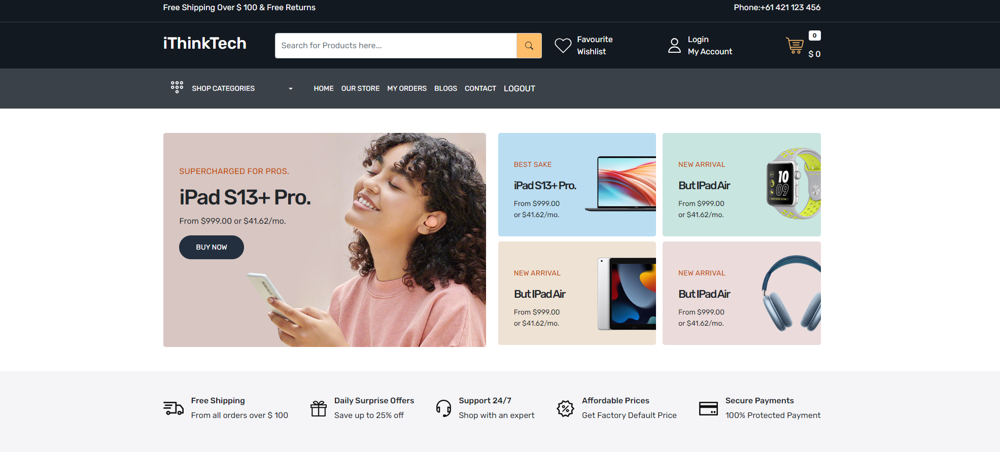
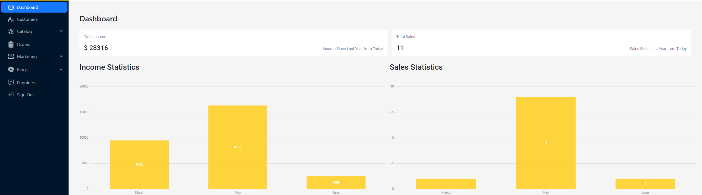

# iThinkTech





## Table of Contents

- [Introduction](#introduction)
- [Features](#features)
- [Technologies Used](#technologies-used)
- [Backend Dependencies](#backend-dependencies)
- [Getting Started](#getting-started)
- [Support & Contact](#support-&-contact)
- [Demo](#demo)
- [Contributing](#contributing)
- [License](#license)

## Introduction

Welcome to our E-commerce app built using the `MERN` stack, `Redux Toolkit`, `Bootstrap`, and custom `CSS`.
This robust e-commerce platform is designed to provide both admins and users with a smooth shopping experience.

## Features

### Admin Panel

- **Login Route**: Separate login route for admin functionality.
- **CRUD Operations**: Create, Read, Update, Delete & Edit:
  - Products
  - Blogs
  - Brands
  - Blog Categories
  - Colors
  - Coupons
  - Customers
  - Enquiries
  - Product Categories
  - Images

### User Features

- User Authentication: Login & Logout features.
- Product:
  - Wishlist: Save products for later.
  - Search: Find products with ease.
  - Cart: Add products to cart.
  - Checkout: Seamless checkout process.
- My Orders: View all your past orders.
- Password Reset: Easily reset forgotten passwords.
- My Profile: Update and view your personal information.
- Contact Us: Send enquiries or feedback using nodemailer.
- Payment Gateways: Razorpay & Stripe integration for payments.

## Technologies Used

- **MERN Stack**: MongoDB, ExpressJS, React, Node.js.
- **State Management**: Redux Toolkit.
- **Design & Styling**: Bootstrap and custom CSS.

## Backend Dependencies

Below are the backend dependencies used in the project:

- `bcrypt`: For hashing and verifying passwords.
- `body-parser`: Middleware to parse incoming request bodies.
- `cloudinary`: Cloud service for storing images.
- `cookie-parser`: Parse cookie header and populate req.cookies.
- `cors`: Enabling CORS.
- `dotenv`: Loading environment variables.
- `express`: Web framework for Node.js.
- `express-async-handler`: Middleware to handle exceptions in async functions.
- `jsonwebtoken`: For generating JWTs used for authentication.
- `mongoose`: MongoDB object modeling for Node.js.
- `morgan`: HTTP request logger.
- `multer`: Middleware for handling `multipart/form-data`.
- `nodemailer`: For sending emails.
- `razorpay`: Razorpay payment gateway integration.
- `sharp`: For resizing images.
- `slugify`: For generating slugs from strings.
- `stripe`: Stripe payment gateway integration.
- `uniqid`: Generate unique IDs.

## Getting Started

To get started with the app:

1. Clone the repository.

```
git clone https://github.com/Artur0705/ECommerce-website.git
```

2. Navigate to the root directory and run `npm install` to install all dependencies.
3. Set up your environment variables in a `.env` file at the root of your project.
4. Run `npm start` to start the application.

## Demo

Check out the live demo of our E-Commerce App [here](https://ithinktech.herokuapp.com/).

## Contributing

- Pull requests are welcome. For major changes, please open an issue first to discuss what you would like to change.

## License


- This project is licensed under the [MIT](https://choosealicense.com/licenses/mit/)
